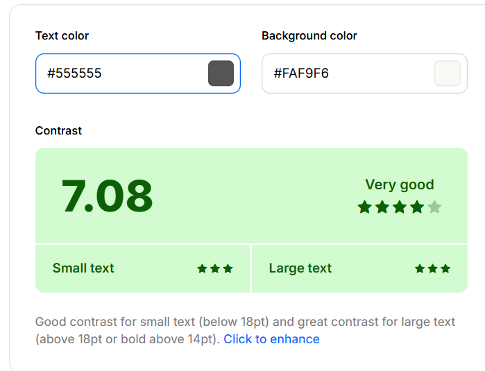
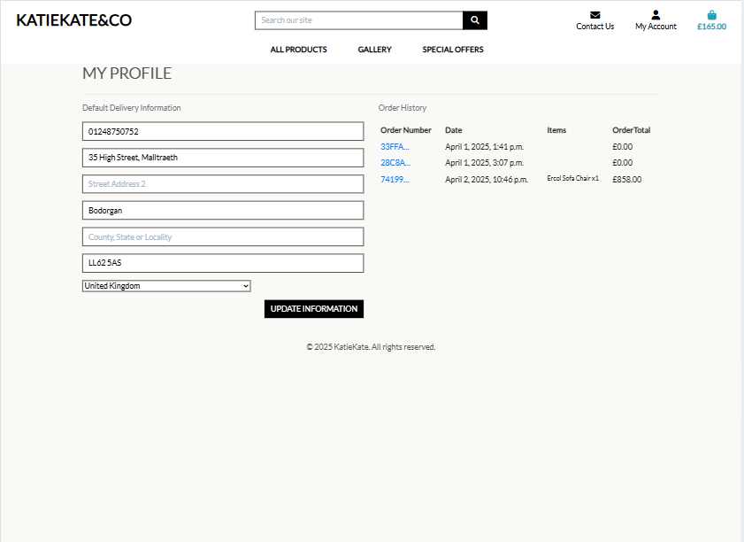
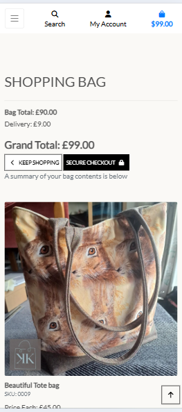
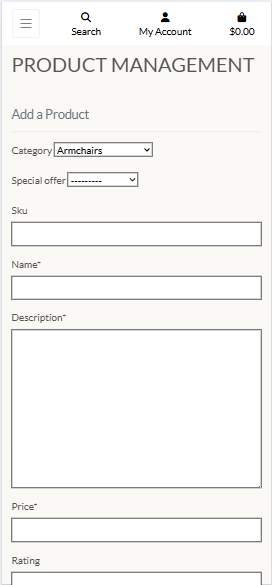
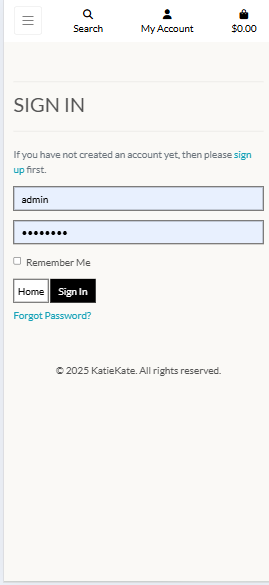
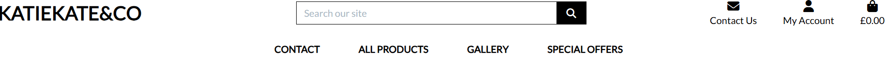

# KatieKate&Co

Katiekate & Co is an upholstery business dedicated to reviving forgotten treasures through bespoke craftsmanship. With a strong emphasis on recycling, reviving, and renewing, the business is committed to preventing furniture from ending up in landfill by transforming neglected pieces into beautifully restored, meaningful creations. The website showcases a gallery of previous commissions, highlighting skillfully reimagined pieces. Visitors can explore and purchase current products, as well as connect to discuss custom upholstery projects. Rooted in a passion for creativity and sustainability, Katiekate & Co gives new life to cherished heirlooms and forgotten furniture.
KatieKate&Co was created as my fourth and final milestone project for the Code Institutes Level 5 Diploma in Web Application Development.

[View the live project here.](https://katiekate-729242823673.herokuapp.com/)


## User Experience (UX) 

### User stories

### Viewing and Navigation

| As a... | I want to be able to… | So that I can… |
|---------|----------------------|----------------|
| User    | Have an immediate understanding as to the purpose of the site | Deduce quickly whether this is the right website for me |
| User    | View current list of products for sale | Be able to filter the products by category |
| User    | Select some to purchase with ease | View previous commissioned products in a gallery list view |
| User    | Be able to filter gallery items by category | Be able to scroll through these gallery images easily |
| User    | View individual product details | Identify the price, description, product rating, product image |
| User    | View details of gallery items | View gallery item details, name, and description |
| User    | Quickly identify deals, clearance items, and special offers | |
| User    | Easily check the total cost of purchases anytime | |
| User    | Read reviews from past customers | Make well-informed decisions about the products |

---

### Registration and User Accounts

| As a...         | I want to be able to…                                 | So that I can… |
|-----------------|------------------------------------------------------|----------------|
| Registered User | Easily register for an account                       | Create a personal account and access my profile anytime |
| Registered User | Easily login or logout                               | View and manage my personal account details |
| Registered User | Easily reset my password if I forget it             | Restore account access |
| Registered User | Get an email confirmation upon registration         | Confirm that my account was successfully created |
| Registered User | Have a personalized user profile                    | |
| Registered User | Ensure my email address is verified by the site     | Make sure my email and personal data are secure |
| Registered User | See my past order history                           | View my personal order history and current address details |
| Registered User | Have the ability to update address details          | |
| Registered User | Be able to leave reviews for purchased items        | Share my experiences to help others |

---

### Sorting and Searching

| As a... | I want to be able to…                        | So that I can… |
|---------|---------------------------------------------|----------------|
| User    | Sort the list of available products         | Quickly find top-rated, best-priced products by category |
| Shopper | Search for a product by name or description | Easily locate a specific product |
| User    | Quickly view my search and the number of results | Determine if the product I want is available |
| User    | Store my billing and delivery details       | Enjoy a faster checkout in future orders |
| User    | Edit/Update my reviews                      | Modify my review if my opinion changes |
| User    | Delete my reviews                           | Remove my review if I no longer find it relevant |

---

### Purchasing and Checkout

| As a... | I want to be able to…                                             | So that I can… |
|---------|------------------------------------------------------------------|----------------|
| User    | Easily select and add to the bag the correct product & quantity  | Make sure I don’t mistakenly choose the wrong product & quantity |
| User    | See the items in my shopping bag before purchasing               | Review the total cost of my purchase |
| User    | View the total cost of my purchase before checking out           | Ensure I know the total cost including shipping |
| User    | Modify the quantity of items in my bag                           | Quickly update my purchase before checkout |
| User    | Easily enter my payment information                              | Complete checkout smoothly |
| User    | Trust that my personal and payment info is secure               | Confidently provide payment details |
| User    | See an order confirmation at checkout                            | Ensure I haven't made any errors |
| User    | Get an email confirmation after checkout                         | Save the confirmation for future reference |
| User    | Contact the store for quotes or questions                        | Obtain additional information about a service or product |
| User    | Quickly check if there are items in my shopping basket           | Instantly see if my basket contains any items |
| Shopper | Checkout without registering for an account                     | Complete my purchase quickly without an account |

---

### Admin and Store Management

| As a...                | I want to be able to…                           | So that I can… |
|------------------------|------------------------------------------------|----------------|
| Store Owner/Staff Member | Add a product                                  | Easily add new items to the store |
| Store Owner/Staff Member | Edit/Update a product                         | Modify product details |
| Store Owner/Staff Member | Delete a product                              | Remove items that are no longer for sale |
| Store Owner/Staff Member | Add a gallery item to the collection          | Add new gallery items |
| Store Owner/Staff Member | Edit/Update a gallery item                    | Modify gallery name, description, or image |
| Store Owner/Staff Member | Delete a gallery item                         | Remove gallery items if necessary |


### Design

#### Colour Scheme


-   ##### Main Colours Used
    - Text colour 1 - #000000
    - Text colour 2 -  #555555
    - Text colour 3 -  #ffffff
    - Background colour - #FAF9F6
    - Button colour 1 - #000000
    - Button colour 2 - #ffffff
    - Button colour 3 (Call to action) - #FF6347 
    - Button text colour 1 - #ffffff
    - Badge text colour 1 - #000000
    - Badge text colour 3 - #ffffff 

#### Colour Accessibility

This webstore is designed with simplicity in mind, using a white background and black text to provide a high-contrast, readable experience. This design follows accessibility best practices to ensure that our content is easily readable by users, including those with visual impairments or color blindness.

This website has been tested against the Web Content Accessibility Guidelines (WCAG) to ensure compliance with accessibility standards. This helps ensure that the contrast between text and background meets the recommended ratios for readability, offering a better experience for users with various accessibility needs.


For further information on these guidelines, you can visit the following link. [Web Content Accessibility Guidelines (WCAG) 2.1 (w3.org)](https://www.w3.org/TR/WCAG21/).
        

- ##### Colour Palette and Results
    - Text Colour 1 - [Coolors Contrast Checker](https://coolors.co/contrast-checker/084298-ffffff)<br>
    
    


#### Typography
The main considerations for the font were aesthetics and accessibility. I chose the Lato font because of its modern and clean design, which is both visually appealing and highly readable. Lato is a widely used sans-serif font, developed by Google, ensuring good availability across a wide range of devices and platforms. This choice helps maintain a sleek, contemporary look while also ensuring accessibility for all users.

 - ##### Fallback Font

    The fallback fonts Arial and sans-serif were chosen to ensure consistent readability and a clean design in the event that the primary Lato font is unavailable. Arial is a widely available, highly legible sans-serif font, making it a reliable secondary option. The generic sans-serif ensures that, regardless of the user's device, the text will always be displayed in a clean, modern style.  


#### Imagery

  - ##### Welcome Image
    The welcome/hero image is from adobe stock images and has been properly licensed for use. 
    


  - #### Product Images
    All product images are the store owners own. 

All other imagery on the website are basic icons obtained from Font Awesome which can be found [here](https://fontawesome.com/).


### Wireframes

The wireframes for this project were hand-drawn, as I prefer to sketch my initial ideas to capture the overall structure and flow of the design. Whilst separate wireframes were not created for mobile and tablet, the layout is consistent across all screen sizes, ensuring a smooth responsive design.

  - #### Desktop Wireframes

|  |  |  |
|:----------------------------:|:-----------------------------:|:--------------------------:|
|  |    |                            |


  - #### Tablet & Mobile Wireframes


  
### Database Schema


[Back to top](#title)  

### Features

- Fully responsive across all screen sizes.

<### Desktop

| Page                         | Screenshot                                                                 |
|------------------------------|---------------------------------------------------------------------------|
| Welcome page                  |            |
| Products page                 |             |
| Product details page          |      |
| Gallery page                  |      |
| Gallery details page          |      |
| Gallery image full page view  |      |
| Shopping bag page             |         |
| Checkout page                 |             |
| Checkout success page         |     |
| Profile page                  |              |
| Add product page       |   |
| Product Management page             |          |
| Edit product page            |          |
| Add Gallery Item page         |         |
| Edit Gallery Item page             |         |
| Login page                    |                   |
| Logout page                   |                  |
| Register page                 |                |
| Contact page                 |                |

---

### Tablet

| Page                         | Screenshot                                                                 |
|------------------------------|---------------------------------------------------------------------------|
| Welcome page                  |            |
| Products page                 |             |
| Product details page          |      |
| Gallery page                  |      |
| Gallery details page          |      |
| Gallery image full page view  |      |
| Shopping bag page             |         |
| Checkout page                 |             |
| Checkout success page         |     |
| Profile page                  |              |
| Add product page       |   |
| Product Management page             |          |
| Edit product page            |          |
| Add Gallery Item page         |         |
| Edit Gallery Item page             |         |
| Login page                    |                   |
| Logout page                   |                  |
| Register page                 |                |
| Contact page                 |                |

---

### Mobile

| Page                         | Screenshot                                                                 |
|------------------------------|---------------------------------------------------------------------------|
| Welcome page                  |            |
| Products page                 |             |
| Product details page          |      |
| Gallery page                  |      |
| Gallery details page          |      |
| Gallery image full page view  |      |
| Shopping bag page             |         |
| Checkout page                 |             |
| Checkout success page         |     |
| Profile page                  |              |
| Add product page       |   |
| Edit product page            |          |
| Add Gallery Item page         |         |
| Edit Gallery Item page             |         |
| Login page                    |                   |
| Logout page                   |                  |
| Register page                 |                |
| Contact page                |                |


<hr>

-The site is designed to be intuitive and easy to navigate, with a top navbar on larger screens and a sidenav on smaller screens. Navigation options dynamically adjust based on whether the user is logged in, has superuser status, or has items in their shopping bag.

A search function allows customers to quickly find specific products, and clearly labeled buttons throughout the site further enhance seamless navigation.

 
 


<hr>

- Full account management including the ability to...
	- Sign in
	- Sign out
	- Sign up
	- Reset forgotten passwords

	The core account management functionality is powered by Django AllAuth, but the pages have been restyled to match the site's design and ensure full responsiveness.

   
<hr>

-A homepage designed to immediately communicate the site's purpose to the user.

  
<hr>

- A contact button is always accessible in the navbar or navbar toggle on mobile view, providing users with a quick and convenient way to reach the store for any inquiries.

  
  
<hr>

- A product page displaying essential product details and images, along with filtering and sorting options to help users easily browse and find items in the store. 

  
  

<hr>

- A product details view provides more indepth information about the product. It also shows reviews associated with that product. 

  
 
<hr>

-The ability to add items to the shopping bag, update quantities, or remove them as needed before making a purchase. Quantities can also be adjusted on the checkout view as well. 

  
  
  
<hr>

- A secure checkout page, powered by Stripe, displaying an order summary and allowing registered users to save their details for future purchases.

  
  
<hr>

- A checkout success page providing order confirmation along with a detailed order summary.

 
 
<hr>

- A user profile page allowing users to view and update their default delivery details and access their order history to review past purchases.

  
  
<hr>

- For super users, a product management  and gallery manaagement link is made available in their account, allowing them to add, edit, and delete product and gallery items.

  
<hr>

- Custom success, warning, and error messages provide customers with feedback on their actions while navigating the site. Additionally, a preview of the shopping cart is shown whenever changes are made to the items in the bag.

    
<hr>

- Confirmation emails are sent for all orders and whenever a customer contacts the store through the 'Contact' modal on the site.

  
  
  
  
<hr>

- A scroll-to-top arrow on the products page that only appears when the customer starts scrolling down.

  
  
<hr>


### Future Features

Given additional time and resources, some future features I would like to incorporate into this upholstery website include:

- The ability to sign up and sign in using social accounts such as Google or Facebook for a quicker and more convenient registration process.
- I ran out of time to get a reviews on products functioning - this is something that I will do outside of the course, 
- A review restriction feature that ensures only customers who have purchased a product can leave a review for that item, ensuring authenticity and trust.
- A workshop section where the store owner can update and display information about upcoming upholstery courses, allowing customers to easily see when the next session will be available.
- An online upholstery calculator that allows customers to input their furniture dimensions and get an instant estimate for reupholstery services.


### Accessibility
-   Semantic HTML to improve structure and readability for assistive technologies.
-   Ensured that colors and text comply with accessibility standards outlined by w3.org.set by [w3.org](https://www.w3.org/TR/WCAG21/).
-   Made all clickable buttons and links keyboard-navigable (tabbable) for better accessibility.
-   Added descriptive alt tags to all images to provide context for screen readers.
-   Using  appropriate ARIA labels where necessary to improve accessibility for users with disabilities.
-   Designed the website with usability in mind, ensuring it is intuitive and easy to navigate for all users. 

### Development Process  

The development of this project followed a structured approach to ensure a functional, user-friendly, and visually appealing upholstery website. The key stages included:  

#### 1. Planning & Research  
- Defined project goals and target audience.  
- Researched competitor websites to identify best practices.  
- Created hand-drawn wireframes to visualize the layout and user flow.  

#### 2. Design & Accessibility  
- Chose a clean, modern design with an emphasis on readability and ease of navigation.  
- Ensured compliance with WCAG accessibility standards by using semantic HTML, proper color contrast, and ARIA attributes.  

#### 3. Development  
- Built the site using HTML, CSS, JavaScript, and Django for backend functionality.  
- Implemented Django AllAuth for authentication and secure user account management.  
- Integrated Stripe payments for a seamless and secure checkout process.  
- Added defensive programming techniques to prevent unauthorized access and accidental deletions.  

#### 4. Testing & Debugging  
- Conducted manual testing across different devices and screen sizes to ensure full responsiveness.  
- Performed WCAG accessibility testing to confirm usability for all users.  
- Checked for browser compatibility and fixed any inconsistencies.  

#### 5. Future Improvements  
- Identified potential enhancements, such as social media login, custom upholstery quotes, and interactive product visualization, for future development.  

This structured approach ensured a smooth development process while keeping the project aligned with user needs and business goals.


[Back to top](#title)  

## Technologies Used

### Languages Used
-   HTML
-   CSS
-   Vanilla javaScript
-   Python


### Databases Used
-   sqlite3 in development - A relational database
-   PostgreSQL via ElephantSQL in production - A relational database

### Frameworks, Libraries & Programs Used

-   [Amazon AWS](https://aws.amazon.com/) 
-   [Bootstrap](https://getbootstrap.com/) 
-   [Boto3](https://boto3.amazonaws.com/v1/documentation/api/latest/index.html) 
-   [Cloud Convert](https://cloudconvert.com/) 
-   [Code Institute PEP8 Python Linter](https://pep8ci.herokuapp.com/) 
-   [Coolors](https://coolors.co/) 
-   [dj-database-url](https://pypi.org/project/dj-database-url/) 
-   [Django](https://www.djangoproject.com/) 
-   [Django Crispy Forms](https://django-crispy-forms.readthedocs.io/en/latest/) 
-   [Font Awesome](https://fontawesome.com/)
-   [Git](https://git-scm.com/) 
-   [GitHub](https://github.com/) 
-   [Google Dev Tools](https://developer.chrome.com/docs/devtools)
-   [Google Fonts](https://fonts.google.com/)
-   [Gmail](https://mail.google.com/) 
-   [Gunicorn](https://gunicorn.org/) 
-   [Heroku](https://www.heroku.com/) 
-   [JSHint](https://jshint.com/) 
-   [Mini Webtool](https://miniwebtool.com/django-secret-key-generator/) 
-   [Pillow](https://pillow.readthedocs.io/en/stable/)  
-   [Psycopg2](https://pypi.org/project/psycopg2/)
-   [Stripe](https://stripe.com/gb) 
-   Lighthouse - Built into Google Dev Tools for testing.
-   [SQLAlchemy](https://www.sqlalchemy.org/) 
-   [VS Code](https://code.visualstudio.com/) 
-   [Website Mockup Generator](https://websitemockupgenerator.com/)
-   [W3C](https://www.w3.org/)


[Back to top](#title)  

## Testing

Refer to [TESTING.md](TESTING.md) for details on all testing conducted.


## Deployment

The project was deployed to [Heroku](https://www.heroku.com/) using a free relational database from [ElephantSQL](https://www.elephantsql.com/). Before deploying to Heroku, I first set up the database, so the deployment process is explained in two parts.


### Heroku

1. To successfully deploy on Heroku we first to install some dependencies to that you can use Postgres on your deployed site. 

    ```bash
    pip3 install dj_database_url
    pip3 install psycopg2
    ```

2. We then need to create some files: a requirements.txt file and a Procfile.

3. The requirements.txt file contains all the applications and dependencies that are required to run the app. To create the requirements.txt file run the following command in the terminal:

    ```bash
    pip3 freeze --local > requirements.txt
    ```

4. The Procfile tells Heroku which files run the app and how to run it. To create the Procfile run the following command in the terminal:

    ```bash
     web: gunicorn [your app name].wsgi:application
    ```

5. If the Procfile has been created correctly it will have the Heroku logo next to it. It is also important to check the Procfile contents, as sometimes on creation a blank line will be added at the end of the file. This can sometimes cause problems when deploying to Heroku, so if the file contains a blank line at the end, delete this and save the file. Make sure to save both these files and then add, commit and push them to GitHub.

6. Login (or sign up) to [Heroku.com](https://www.heroku.com).

7. Click the new button and then click create new app.

8. You will then be asked to give your app a name (these must be unique) and select a region. Once these are completed click create app.

9. You will now need to connect the Heroku app to the GitHub repository for the site. Select GitHub in the deployment section, find the correct repository for the project and then click connect.

10. Once the repository is connected, you will need to provide Heroku some config variables it needs to build the app. Click on the settings tab and then click reveal config vars button. You will now need to add the environment key/value variables some of which were used in the env.py file and some of which will be different:

    | KEY | VALUE |
    | -- | -- |
    | AWS_ACCESS_KEY_ID | `your variable here if you have it already` |
    | AWS_SECRET_ACCESS_KEY | `your variable here if you have it already` |
    | DISABLE_COLLECTSTATIC | 1* |
    | DATABASE_URL | `your variable here`** |
    | EMAIL_HOST_PASS | `your variable here` |
    | EMAIL_HOST_USER | `your variable here` |
    | SECRET_KEY | `your variable here` |
    | STRIPE_PUBLIC_KEY | `your variable here` |
    | STRIPE_SECRET_KEY | `your variable here` |
    | STRIPE_WH_SECRET | `your variable here` |
    | USE_AWS | True |
    | DEVELOPMENT | True*** |

    *This is temporary and will be removed later.

    **This is where we paste our database url

    ***This variable is to be deleted once debugging is complete and you are ready to deploy your "production" app.

11. You then need to add the hostname of your Heroku app to settings.py which can be found in the Heroku settings tab under Domains.

    ```bash
    ALLOWED_HOSTS = ['https://katiekate-729242823673.herokuapp.com/', 'localhost']
    ```

12. We now need to migrate our database to our databse. Go to the top right hand of Heroku and select, more then select Run console. Type bash and click Run then type the following commands.

    ```bash
    python3 manage.py makemigrations --dry-run
    python3 manage.py makemigrations
    python3 manage.py migrate --plan
    python3 manage.py migrate
    ```
    
13. Assuming all your migrations were completed succesfully you can now create your superuser by running the below command and filling in your details.

      ```bash
      python3 manage.py createsuperuser    
      ```

14. Now that the relational database has been set up and the tables created and superuser created, we can now click open app and the application should now open in a new tab. If you haven't set up your AWS yet your CSS and images wont have loaded yet. We will set that up next.

### Amazon AWS

  #### Setting up an S3 Bucket
  1. Create an [Amazon AWS](aws.amazon.com) account

  2. Search for **S3** and create a new bucket
      - Allow public access
      - Acknowledge

  3. Under **Properties > Static** website hosting
      - Enable
      - `index.html` as index document
      - Save

  4. Under **Permissions > CORS** use:
      ```bash
          [
        {
            "AllowedHeaders": [
                "Authorization"
            ],
            "AllowedMethods": [
                "GET"
            ],
            "AllowedOrigins": [
                "*"
            ],
            "ExposeHeaders": []
        }
      ]
      ```

  5. Under **Permissions > Bucket Policy**:
      - Generate Bucket Policy and take note of **Bucket ARN**
      - Chose **S3 Bucket Policy** as Type of Policy
      - For **Principal**, enter `*`
      - Enter **ARN** noted above
      - **Add Statement**
      - **Generate Policy**
      - Copy **Policy JSON Document**
      - Paste policy into **Edit Bucket policy** on the previous tab
      - Save changes

  6. Under **Access Control List (ACL)**:
      - For **Everyone (public access)**, tick **List**
      - Accept that everyone in the world may access the Bucket
      - Save changes

  #### Setting up AWS IAM
  1. From the **IAM dashboard** within AWS, select **User Groups**:
      - Create new group e.g. `manage-Katiekate`
      - Click through without adding a policy
      - **Create Group**

  2. Select **Policies**:
      - Create policy
      - Under **JSON** tab, click **Import managed policy**
      - Choose **AmazongS3FullAccess**
      - Edit the resource to include the **Bucket ARN** noted earlier when creating the Bucket Policy:

      ```bash
            "Resource": [
                            "arn:aws:s3:::katiekate",
                            "arn:aws:s3:::katiekate/*"
                  ]
      ```

      - Click **next step** and go to **Review policy**
      - Give the policy a name e.g. `katiekate-policy` and description
      - **Create policy**

  3. Go back to **User Groups** and choose the group created earlier
      - Under **Permissions > Add permissions**, choose **Attach Policies** and select the one just created
      - **Add permissions**

  4. Under **Users**:
      - Choose a user name e.g. `katiekate-staticfiles-user`
      - Select **Programmatic access** as the **Access type**
      - Click Next
      - Add the user to the Group just created
      - Click Next and **Create User**

  5. **Download the `.csv` containing the access key and secret access key. This will NOT be available to download again**

  #### Hooking Django up to S3

  1. Install boto3 and django-storages
      ```bash
      pip3 install boto3
      pip3 install django-storages
      pip3 freeze > requirements.txt
      ```

  2. Add the values from the `.csv` you downloaded to your Heroku Config Vars under Settings:
      ```bash
      AWS_ACCESS_KEY_ID
      AWS_SECRET_ACCESS_KEY
      ```

  3. Delete the `DISABLE_COLLECTSTATIC` variable from your Config Vars and deploy your Heroku app, if you have enabled automatic deployment in Heroku this will happen automatically the next push you make to GitHub

  4. With your S3 bucket now set up, you can create a new folder called `media` (at the same level as the newly added `static` folder) and upload any required media files to it, making sure they are publicly accessible under **Permissions**


### Forking the GitHub Repository

By forking the GitHub Repository we make a copy of the original repository on our GitHub account to view and/or make changes without affecting the original repository by using the following steps...

1. Login to GitHub.
2. Locate the repository, you can use a link you have been provided with or use the search function in the top left of the screen.
3. In the top right hand corner of the page locate and click the 'fork' button.
4. Near the bottom of the page click the green button that says 'Create Fork'.
5. You should now have a copy of the original repository in your GitHub account.

### Making a Local Clone

1. Login to GitHub.
2. Locate the repository, you can use a link you have been provided with or use the search function in the top left of the screen.
3. Near the top of the repository click the green 'Code' button.
4. To clone the repository using HTTPS, under HTTPS copy the link provided.
5. Open the terminal in your code editor. 
6. Change the current working directory to the location where you want the cloned directory to be made.
7. Type git clone, and then paste the URL you copied in Step 3.
8. Press Enter. Your local clone should be created.
9. To install all the required dependencies you just need to run the following...
    ```bash
    pip3 install -r requirements.txt
    ```

[Back to top](#title)  

## Credits

### Code

-  This project was developed using Code Institute's Boutique Ado walkthrough as a foundation, with the core functionality of the store built alongside these walkthroughs.


### Content

-   The store owner provided the descriptions for products and gallery items.
-   All other static content for this website was written by the developer.
 


### Acknowledgements

-   David Bowers, for putting me back on the right track. And being a fab mentor generally. 
-   The [Code Institute](https://codeinstitute.net/) student support for their understanding and advice during some challenging circumstances. 
-   The people on my cohort for their support, encouragement and for reviewing my project.

[Back to top](#title)  