<h1>KatieKate&Co</h1>

<h2>Testing</h2>

[View the live project here.](https://katiekate-729242823673.herokuapp.com/)

Extensive testing was carried out throughout the entire development process. In addition to the documented tests outlined below, I gathered feedback from friends and family by having them navigate the site to identify areas that worked well and any issues that needed addressing. I also thoroughly tested the site myself, manually clicking through each feature and function to pinpoint any malfunctions or errors appearing in the console.

If I had more time, I would have implemented automated testing using Jest and Django's testing framework, which is something I plan to explore further in future projects.

In practice, a combination of manual and automated testing is crucial for production code. Automated tests offer speed, especially in large-scale applications, while manual testing helps evaluate the user experience and design intuition. Using both approaches ensures the highest level of quality and reliability for web applications.

## AUTOMATED TESTING

#### HTML Validator - [W3C](https://validator.w3.org/)

| Page | Errors/Warnings | Solution | Image |
| --- | --- | --- | --- |
| Welcome Page | None | N/A | 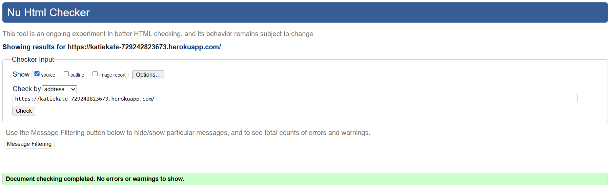 |
| Login Page | None | N/A | 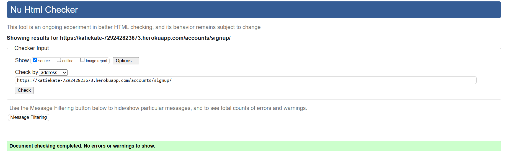 |
| Register Page | None | N/A |  |
| Password Reset Page | None | N/A |  |
| Products Page | None | N/A | 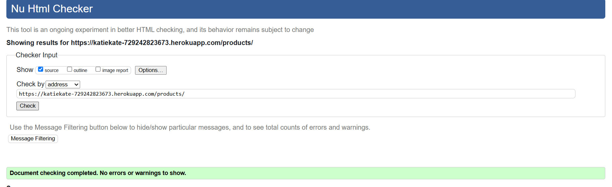 |
| Product Details Page | None | N/A | 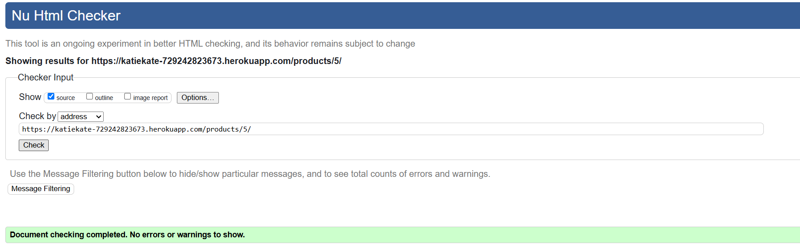 |
| Gallery Page | None | N/A | 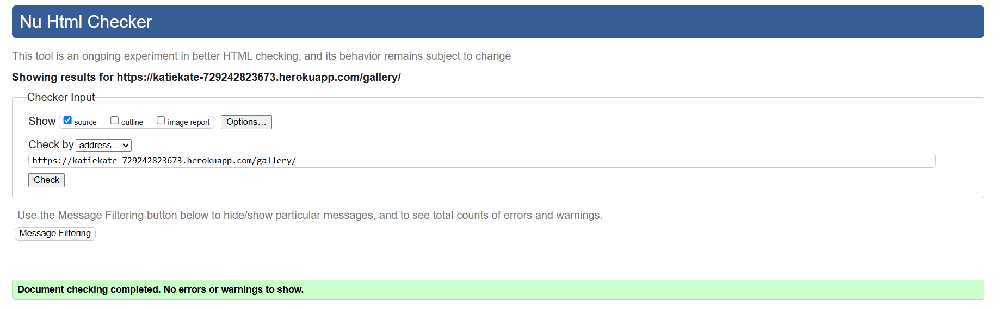 |
| Gallery Item Detail Page | None | N/A | 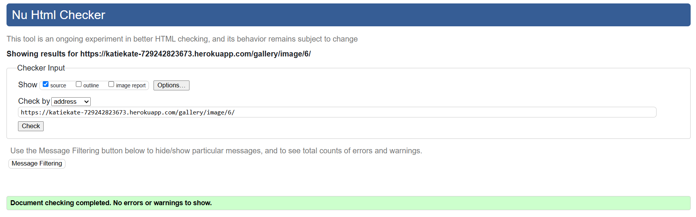 |
| Gallery Item Detail - Full Page View | None | N/A | 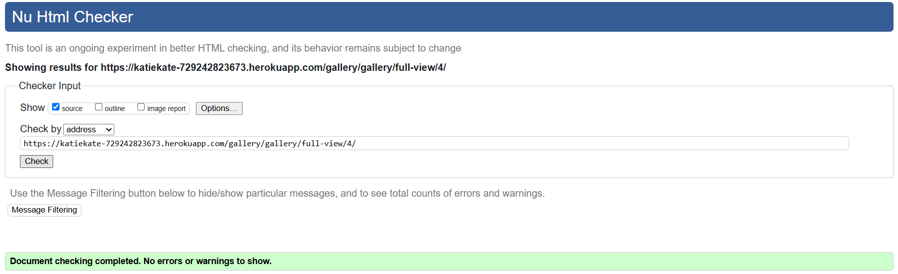 |
| Shopping Bag Page | None | N/A | 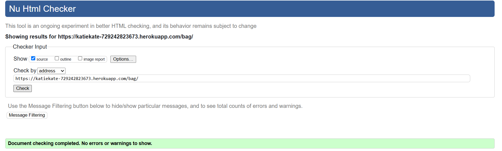 |
| Product management | None | N/A |  |
| Gallery management | None | N/A | 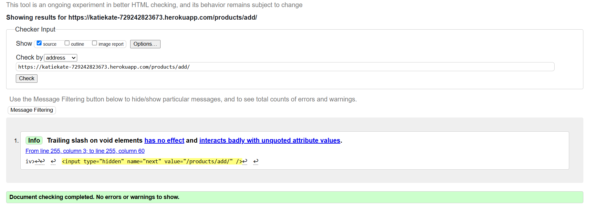 |
| Log out Page | None | N/A | 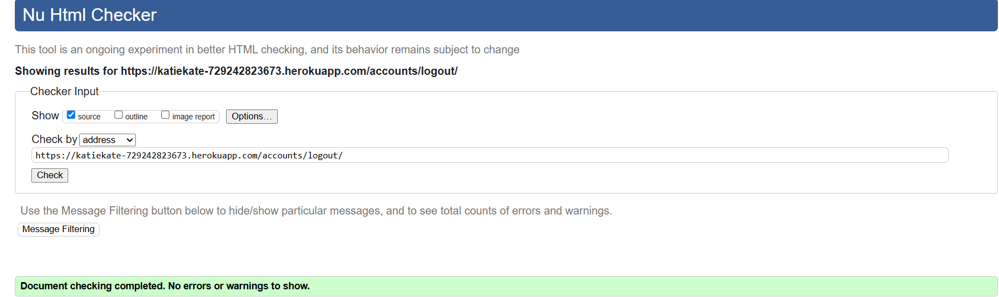 |
| Checkout Page | None | N/A | 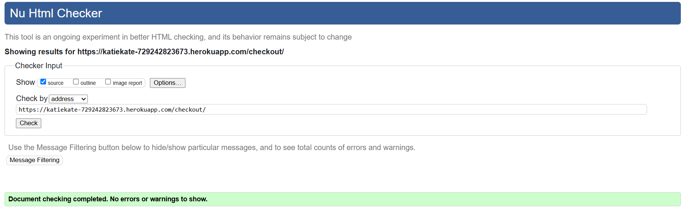 |
| Profile Page | None | N/A | 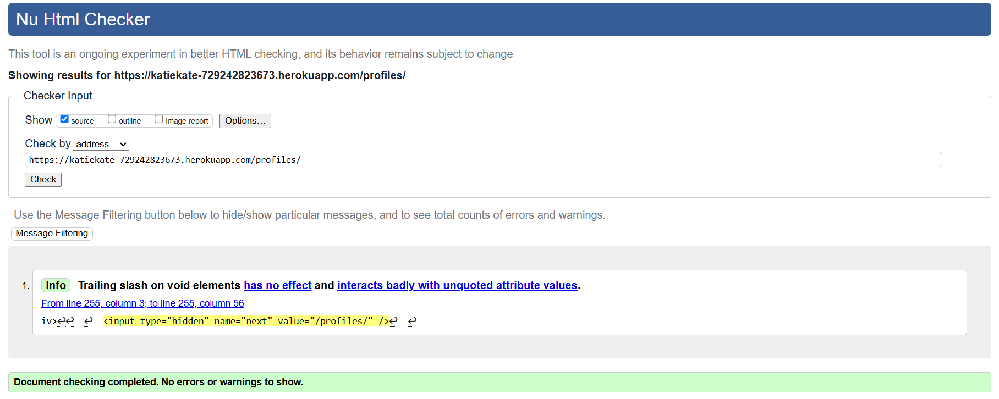 |
| Checkout Success Page | None | N/A | 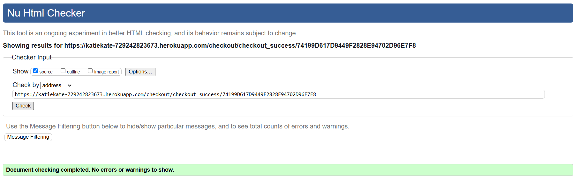 |

#### CSS Validator - [W3C](https://jigsaw.w3.org/css-validator/)

| File | Errors/Warnings | Solution | Image |
| --- | --- | --- | --- |
| base.css | 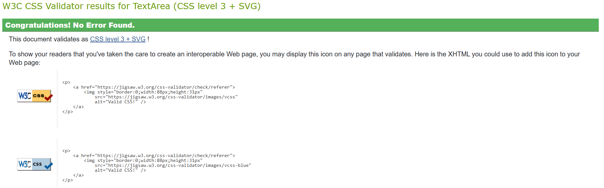 |
| checkout.css | None | N/A |  |
| profile.css | N/A | N/A | 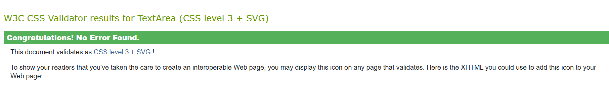 |

#### JSHint Validator - [JSHint](https://jshint.com/)

| File/Page | Errors/Warnings | Solution | Image |
| --- | --- | --- | --- |
| add_edit_product.js | N/A | N/A |  |
| add_product.html | N/A | N/A |  |
| bag.html | N/A | N/A |  |
| countryfield.js | N/A | N/A |  |
| product_detail.html | N/A | N/A  |  |
| product_management.html | N/A | N/A |  |
| products.html | N/A | N/A |  |
| stripe_element.js | N/A | N/A - The Stripe variable is defined outside the main file so no errors are caused in the terminal |  |

#### Python Validator - [Code Institute Python Linter](https://pep8ci.herokuapp.com/) 

I validated all Python code that isn't automatically generated using the Code Institute Python Linter, which returned no errors. As a result, I haven't included additional screenshots for these tests.

### Lighthouse

Lighthouse in Chrome Developer Tools was utilised to assess the website's performance, accessibility, best practices, and SEO.

| Page | Results |
| --- | --- |
| Add Product |  |
| Bag |  |
| Checkout |  |
| Checkout Success |  |
| Edit Product |  |
| Login |  |
| Logout |  |
| Product Details |  |
| Product Management |  |
| Products |  |
| Gallery Item Details - Full page view |  |
| Gallery Item Details |  |
| Gallery Management |  |
| Gallery |  |
| Profile |  |
| Register |  |
| Welcome |  |

## MANUAL TESTING

### Testing User Stories

<table>
    <thead>
        <tr>
            <th>As a...</th>
            <th>I want to be able to…</th>
            <th>This is achieved by...</th>
            <th>Image</th>
        </tr>
        <tr>
            <th colspan="4">Viewing and Navigation</th>
        </tr>
    </thead>
    <tbody>
        <tr>
            <td>User</td>
            <td>Have an immediate understanding as to the purpose of the site</td>
            <td>Deduce quickly whether this is the right website for me</td>
            <td></td>
        </tr>
        <tr>
            <td>User</td>
            <td>View current list of products for sale</td>
            <td>A product listing page displaying all available items with search and sorting functionality.</td>
            <td></td>
        </tr>
        <tr>
            <td>User</td>
            <td>View individual product details</td>
            <td>The products details page</td>
            <td></td>
        </tr>
        <tr>
            <td>User</td>
            <td>View individual Gallery Item details</td>
            <td>The gallery item details page contains descriptions and clicking on the image takes the user to a full screen rendering of the image where they can scroll through all the gallery images</td>
            
            </td>
        </tr>
        <tr>
            <td>User</td>
            <td>Quickly identify deals, clearance items and special offers</td>
            <td>A prominently placed dropdown link for special offers.</td>
            </tr>
            
        </tr>
        <tr>
            <td>User</td>
            <td>Easily check the total cost of your purchases anytime.</td>  
            <td>The navbar features a basket icon displaying the total purchase amount.</td>           <
            
            </td>
        </tr>
    </tbody>
    <thead>
        <tr>
            <th colspan="4">Registration and User Accounts</th>
        </tr>
    </thead>
    <tbody>
        <tr>
            <td>Registered User</td>
            <td>Easily register for an account</td>
            <td>A prominently displayed register link in the account dropdown.</td>
            <td>
                
            </td>
        </tr>
        <tr>
            <td>Registered User</td>
            <td>Easily login or logout</td>
            <td>The login and logout buttons are easily accessible from the account dropdown in the navbar</td>
            <td>
                
            </td>
        </tr>
        <tr>
            <td>Registered User</td>
            <td>Easily recover my password in case I forget it</td>
            <td>The login page features a clearly visible "Forgot my password" link for password recovery.</td>
            <td>
                
            </td>
        </tr>
        <tr>
            <td>Registered User</td>
            <td>Receive an email confirmation after registering</td>
            <td>An email is sent upon registration, requiring verification by clicking the link provided.
            </td>
            <td>
                
            </td>
        </tr>
        <tr>
            <td>Registered User</td>
            <td>Have a personalised user profile</td>
            <td>The user profile displays default delivery information and order history.</td>
            <td>
                
            </td>
        </tr>
        <tr>
            <td>Registered User</td>
            <td>Verify my email address with the site</td>
            <td>All email addresses must be verified upon new account registration</td>
            <td>
                
            </td>
        </tr>
        <tr>
            <td>Registered User</td>
            <td>See my past order history</td>
            <td>Profile page displays past order history alongside default user address</td>
            <td>
                
            </td>
        </tr>
    </tbody>
    <thead>
        <tr>
            <th colspan="4">Sorting and Searching</th>
        </tr>
    </thead>
    <tbody>
        <tr>
            <td>User</td>
            <td>Sort the list of available products</td>
            <td>Products can be sorted using various filters on the main products page and are also categorized in the navbar.</td>
            <td>
                
                
            </td>
        </tr>
        <tr>
            <td>User</td>
            <td>Search for a product by name or description</td>
            <td>Users can search for products by keyword using the search bar at the top of the website.</td>
            <td>
                
            </td>
        </tr>
        <tr>
            <td>User</td>
            <td>Store my billing and delivery details</td>
            <td>Users can update these anytime via their profile page or by using the save button on the checkout page.<td>
                
                
            </td>
        </tr>
        <tr>
            <td>Shopper</td>
            <td>Delete my reviews</td>
            <td>Reviews can be deleted in the users profile page</td>
            <td>
                
            </td>
        </tr>
    </tbody>
    <thead>
        <tr>
            <th colspan="4">Purchasing and Checkout</th>
        </tr>
    </thead>
    <tbody>
        <tr>
            <td>User</td>
            <td>Easily select and add to bag the correct product and quantity</td>
            <td>Quantity selector buttons and a prominently placed "Add to Bag" button ensure easy selection of the correct product and quantity</td>
            <td>
                
            </td>
        </tr>
        <tr>
            <td>User</td>
            <td>See the items in my shopping bag before purchasing</td>
            <td>Clicking the shopping bag icon directs the user to their shopping bag to view selected items.</td>
            <td>
                
            </td>
        </tr>
        <tr>
            <td>User</td>
            <td>View the total cost of my purchases before checking out</td>
            <td>The total cost is shown in the cart basket icon on the navbar and on the checkout page.</td>
            <td>
                
                
            </td>
        </tr>
        <tr>
            <td>User</td>
            <td>Modify the quantity of items in my bag</td>
            <td>Items in the shopping bag can be effortlessly updated or removed using the quantity update button on the checkout pag</td>
            <td>
                
                
            </td>
        </tr>
        <tr>
            <td>User</td>
            <td>Easily enter my payment information</td>
            <td>At checkout, Stripe provides a streamlined and secure payment entry box for a hassle-free transaction experience.</td>
            <td>
                
            </td>
        </tr>
        <tr>
            <td>User</td>
            <td>Trust that my personal and payment information is secure</td>
            <td>The checkout button clearly indicates a secure transaction, reassuring customers of their safety. Additionally, Stripe’s trusted reputation enhances confidence in the payment process.</td>
            <td>
                
            </td>
        </tr>
        <tr>
            <td>User</td>
            <td>See an order confirmation at checkout</td>
            <td>After completing checkout, the customer is redirected to an order confirmation page and also receives a confirmation email.</td>
            <td>
                
                
            </td>
        </tr>
        <tr>
            <td>User</td>
            <td>Receive an email confirmation after checking out</td>
            <td>Customers receive an instant confirmation email as soon as their order is successfully placed.</td>
            <td>
                
            </td>
        </tr>
        <tr>
            <td>User</td>
            <td>Contact the store easily with any questions for quotations of reupholster</td>
            <td>Users can easily contact the store by clicking the contact icon in the navbar, allowing them to send messages directly.</td>
            <td>
                
                
            </td>
        </tr>
        <tr>
            <td>User</td>
            <td>Quickly check if there are items in my shopping basket/td>
            <td>On larger screens, the shopping bag icon displays the total price of items in the bag, while on smaller screens, a dedicated icon appears within the navbar toggler for easy access.</td>
            <td>
                
                
                
            </td>
        </tr>
        <tr>
            <td>User</td>
            <td>Checkout without needing to register for an account</td>
            <td>Guests can check out without an account, with an option to sign up for future convenience.<td>
                
            </td>
        </tr>
    </tbody>
    <thead>
        <tr>
            <th colspan="4">Admin and Store Management</th>
        </tr>
    </thead>
    <tbody>
        <tr>
            <td>Store Owner/Staff Member</td>
            <td>Add a product</td>
            <td>New products can be easily added through the product management section.</td>
            <td>
                
                
            </td>
        </tr>
        <tr>
            <td>Store Owner/Staff Member</td>
            <td>Edit/Update a product</td>
            <td>Products can be easily edited and updated in the product management section</td>
            <td>
                
            </td>
        </tr>
        <tr>
            <td>Store Owner/Staff Member</td>
            <td>Delete a product</td>
            <td>Products can be removed easily from the store using the product management section.</td>
            <td>
                
                
            </td>
        </tr>
         <tr>
            <td>Store Owner/Staff Member</td>
            <td>Add a Gallery Item</td>
            <td>New Gallery items can be easily added through the Gallery management section.</td>
            <td>
                
                
            </td>
        </tr>
        <tr>
            <td>Store Owner/Staff Member</td>
            <td>Edit/Update a Gallery Item</td>
            <td>Gallery items can be easily edited and updated in the Gallery management section</td>
            <td>
                
            </td>
        </tr>
        <tr>
            <td>Store Owner/Staff Member</td>
            <td>Delete a Gallery item</td>
            <td>Gallery items can be removed easily from the store using the product management section.</td>
            <td>
                
                
            </td>
        </tr>
    </tbody>
</table>

### Devices Used For Testing

The site has altogether in one way or another been used and tested on the following devices...

-   iphone 13 - safari
-   Huaewi p30 pro - Chrome
-   Macbook Pro - Safari and Chrome

### Full Manual Testing

#### Welcome Page

| Feature/Action        | Pass/Fail |
|-----------------------|-----------|
| 'Get a quote' button takes you to the contact page | Pass      |

#### Navbar
| Feature/Action | Pass/Fail |
|----------------|-----------|
| Logo takes you back to the home page | Pass |
| Search bar works and loads the products page with the correct results | Pass |
| All links to product categories take you to the correct page | Pass |
| Account drop down and dropdown links all work and take you to the correct page | Pass |
| Bag button works and takes you to the bag page | Pass |
| Bag button updates dynamically when new items are added to the cart | Pass |
| Contact button launches the contact modal | Pass |
| Contact modal successfully submits a message to the store and both the customer and store receive confirmation emails | Pass |
| Form validation in contact modal works | Pass |
| Navbar collapses to mobile nav on smaller screens | Pass |
| When there are items in the shopping bag a badge appears over the navbar toggler | Pass |
| All links in mobile nav behave identically to the full navbar | Pass |
| Sidenav collapses correctly on click of x or when you click outside the nav | Pass |

#### Footer
| Feature/Action | Pass/Fail |
|----------------|-----------|
| Social links open the correct page in a new tab | Pass |

#### Products Page
| Feature/Action | Pass/Fail |
|----------------|-----------|
| All product images and links are fully interactive, directing users to the correct product pages | Pass      |
| Sorting functions accurately organise products based on selected criteria                | Pass      |
| All images display correctly without distortion or errors                                          | Pass      |
|  Product category badges are interactive, leading users to relevant product listings | Pass      |
| Edit and delete buttons are visible for every product when a superuser is logged in | Pass |
| Clicking the edit button opens a pre-filled product form | Pass |
| Updating a product via the form successfully saves changes | Pass |
| Cancel button returns the superuser to the products page without making changes | Pass |

#### Product Details Page
| Feature/Action | Pass/Fail |
|----------------|-----------|
| Clicking the product image opens a full-size version in a new tab | Pass      |
| Quantity selector buttons function correctly and are disabled outside the valid range (1-99)   | Pass      |
| Items are added to the shopping bag correctly, displaying the appropriate success message | Pass      |
| "Keep Shopping" button redirects users back to the products page | Pass |

#### Bag Page
| Feature/Action | Pass/Fail |
|----------------|-----------|
| Quantity selector buttons function correctly and are disabled outside the valid range (1-99) | Pass |
| "Update" button correctly updates item quantities in the shopping bag | Pass |
| "Remove" button successfully removes items from the shopping bag | Pass |
| Subtotal updates dynamically when items are added, removed, or updated | Pass |
| Bag total, delivery cost, discount, and grand total all adjust accurately in real time | Pass |
| Clicking the product image or name redirects to the product detail page | Pass |
| "Keep Shopping" button navigates back to the products page | Pass |
| "Checkout" button correctly redirects users to the checkout page | Pass |

#### Checkout Page
| Feature/Action | Pass/Fail |
|----------------|-----------|
| Saved delivery details are pre-filled for returning users | Pass |
| Order details and line items accurately reflect the user's selections | Pass |
| Order total, delivery cost, discount, and grand total calculate correctly | Pass |
| Form validation correctly flags errors for improperly formatted details, such as an invalid email | Pass |
| Card validation functions properly, displaying error messages for failed validation | Pass |
| "Adjust Bag" button navigates back to the shopping bag page | Pass |
| "Complete Order" button successfully processes the order and redirects users to the checkout success page | Pass |

#### Checkout Success Page
| Feature/Action | Pass/Fail |
|----------------|-----------|
| Order details are accurately displayed | Pass |
| A success message confirms the order has been placed successfully | Pass |
| User receives an order confirmation email | Pass |

#### Product Management Page
| Feature/Action | Pass/Fail |
|----------------|-----------|
| Add product form correctly renderer | Pass

#### Gallery Management Page
| Feature/Action | Pass/Fail |
|----------------|-----------|
| Add Gallery item form correctly renderer | Pass

#### Profile Page 
| Feature/Action | Pass/Fail |
|----------------|-----------|
| Previously saved default delivery information is auto-filled | Pass |
| Form validation ensures accurate updates to user details in the database | Pass |
| Order history displays all past orders, with order numbers linking to detailed order pages | Pass |

#### 404 Page
| Feature/Action | Pass/Fail |
|----------------|-----------|
| A custom 404 page is displayed when a page is not found | Pass |
| "Take Me Back Home" button redirects users to the homepage | Pass |

#### Add Product
| Feature/Action | Pass/Fail |
|----------------|-----------|
| Add product form validation ensures all required details are entered correctly | Pass |
| "Select Image" button functions correctly and loads the chosen image | Pass |
| "Cancel" button redirects the user back to the product page | Pass |
| "Add Product" button successfully saves the product to the database and returns the user to the product page | Pass |

#### Edit Product
| Feature/Action | Pass/Fail |
|----------------|-----------|
| Existing product data is correctly preloaded into the edit form | Pass |
| Product edit form validation ensures accurate and complete input | Pass |
| "Select Image" button functions properly and displays the chosen image | Pass |
| "Cancel" button successfully redirects the user to the product management page | Pass |
| "Edit Product" button updates the product in the database and returns the user to the product management page | Pass |

#### Add Gallery item to Gallery Collection 
| Feature/Action | Pass/Fail |
|----------------|-----------|
| Add Gallery item form validation ensures all required details are entered correctly | Pass |
| "Select Image" button functions correctly and loads the chosen image | Pass |
| "Cancel" button redirects the user back to the Gallery page | Pass |
| "Add Gallery item" button successfully saves the Gallery item to the database and returns the user to the Gallery page | FAIL |

#### Edit Gallery item in Gallery collection 
| Feature/Action | Pass/Fail |
|----------------|-----------|
| Existing Gallery item data is correctly preloaded into the edit form | Pass |
| Gallery item edit form validation ensures accurate and complete input | Pass |
| "Select Image" button functions properly and displays the chosen image | Pass |
| "Cancel" button successfully redirects the user to the Gallery page | FAIL |
| "Edit Product" button updates the product in the database and returns the user to the Gallery | FAIL |

#### Login Page
| Feature/Action | Pass/Fail |
|----------------|-----------|
| Form validation functions correctly, ensuring accurate user input | Pass |
| "Sign Up" button redirects the user to the sign-up page | Pass |
| "Forgot Password" link correctly redirects the user to the password recovery page | Pass |
| "Home" button redirects the user to the homepage | Pass |
| "Sign In" successfully logs the user in, verifies their details, and redirects them to the homepage with a success message | Pass |
| Signing in restores previously saved cart items | Pass |

#### Logout Page
| Feature/Action | Pass/Fail |
|----------------|-----------|
| Sign out button successfully signs the user out and redirects them to the home page with a success message | Pass |

#### Register Page
| Feature/Action | Pass/Fail |
|----------------|-----------|
| Form validation ensures emails and passwords match, passwords meet security requirements, and no existing account matches the provided details. | Pass |
| The sign-in button successfully redirects the user to the home page after login. | Pass |
| The sign-up button creates a new account and sends a verification email for confirmation. | Pass |

#### Reset Password Page
| Feature/Action | Pass/Fail |
|----------------|-----------|
| When a valid email is entered, the user receives an email with a link to reset their password. | FAIL |
| Clicking the password reset link prompts the user to create a new, secure password. | Pass |
| Password validation ensures that the new password is neither too weak nor previously used. | Pass |
| The new password is successfully updated in the database for future logins. | Pass |

## Bugs

### Solved Bugs

| No. | Bug | How I solved the issue |
|---|---|---|
| 1 | The server could not be started due to a ModuleNotFoundError for the settings module. This issue occurred because Django generated two nested folders (both named katiekate), causing the settings.py file to be placed in a subfolder, which prevented the application from locating it. | Moved the contents of the subfolder to the main katiekate folder.  This allowed Django to locate and load the settings properly, resolving the error and enabling the server to run successfully. |
| 2 | `NameError: name 'get_object_or_404' is not defined`.The error occurred because the `get_object_or_404` function was not imported in `views.py`, causing the product details page not to load properly.
| Added the following import at the top of the views.py file - 'from django.shortcuts import get_object_or_404' |
| 3 | Link badges for Categories not being displayed. This was traced back to the categories variable being initially set to None causing it to be empty when passed to the template. 
As a result, no category badges were rendered. | To resolve this, the code was modified to ensure that all categories are fetched and passed to the template by default when no category filter is applied in the URL query string. Specifically, if no category filter is present in the request, the code now explicitly fetches all categories from the database using Category.objects.all() and assigns them to the categories variable. |
| 4 | The shopping bag icon within the nav-bar wasn’t clickable, and the cursor didn’t change to the hand (pointer) on hover. The issue was due to the HTML structure. The shopping bag icon was nested inside a non-interactive div element without being properly wrapped in a clickable element like an <a> tag. This prevented the browser from recognizing the element as a link, which in turn caused the hand cursor to not appear.| The code now correctly uses an anchor tag to wrap both the icon and the price details, ensuring both are interactive and the hand cursor appears as expected. |
| 5 |The bag.html template was not rendering when accessing the shopping bag page, and the page was either showing a 404 error or failing to display the expected content. The root cause of the issue was that the bag app had not been added to the INSTALLED_APPS list in the Django settings.py file. Without this inclusion, Django was unaware of the app, which meant that it didn't load the templates or views associated with the app. | : To resolve this issue, we added the bag app to the INSTALLED_APPS in the settings.py file, ensuring that Django correctly recognizes the app, loads its templates, and processes its views.|
| 6 | TemplateDoesNotExist error occurred when trying to load products/includes/quantity_input_script.html, which was caused by the includes/ folder being placed outside the templates/ directory. This prevented the template from being found and rendered properly. | The issue was resolved by moving the includes/ folder inside the templates/products/ directory, ensuring the correct file path and structure for template rendering. Always verify that template files are in the correct directories according to Django's template loader system.|
| 7 | CSS was used to apply a pointer cursor to the .update-link and .remove-item buttons, but it did not work because the <a> elements lacked an href attribute, causing browsers to treat them as non-clickable text. As a result, the cursor remained the default text selection style instead of changing to a pointer. | To resolve this, href="javascript:void(0);" was added, ensuring the links were recognized as interactive elements without causing navigation. This worked because browsers require an href for <a> tags to be interactive, and javascript:void(0); prevents any unintended redirection while allowing JavaScript functionality. |
| 8 | After adding a UserProfile model to the profiles app and linking it to the User model, I encountered an issue where logging out of the admin panel prevented me from logging back in, showing the error: "RelatedObjectDoesNotExist: User has no userprofile." This occurred because the admin user, created before the UserProfile model was introduced, didn’t have a UserProfile associated with their account. | To resolve this, I manually linked the admin user to a UserProfile using the Django shell (python manage.py shell). Once the profile was created, I was able to log back in. Going forward, I ensured that the post_save signal was properly set up to automatically create a UserProfile for all new users. |
| 9 | Resolved issue where orders were not found for UserProfile due to a missing migration. | The Order model was updated to include a ForeignKey to UserProfile, and makemigrations + migrate were run to apply the change. The profile view was adjusted to fetch orders correctly using Order.objects.filter(user_profile=profile), preventing the AttributeError. |
| 10 | the view for displaying products with special offers was returning all products, even those without any special offer assigned. This was because the initial query used Product.objects.all(), which fetched all products regardless of whether they had a special offer | To resolve this, the query was modified to filter products from the beginning by including only those that have a special offer assigned, using Product.objects.filter(special_offer__isnull=False). This ensures that only products with a valid special offer are included in the view. Additionally, when a specific special offer (such as "New Arrivals", "Deals", or "Clearance") is provided in the URL, the view further filters the products to display only those linked to the selected special offer.|
| 11 | when logged in the checkout page is not showing the return to profile button as expected |The "Return to Profile" button wasn't working because the from_profile variable, which determines whether the button should be displayed, was not being passed to the template context in the checkout_success view. The template used this variable to check if the user was authenticated, and if so, render the "Back to Profile" button. However, since the from_profile variable was missing in the context, the condition in the template couldn't be evaluated properly. By adding the line 'from_profile': True if request.user.is_authenticated else False to the context when rendering the template, the correct value was passed to the template, allowing it to conditionally render the appropriate button based on whether the user was logged in or not.

### Unsolved Bugs
| No. | Bug. |
|---|---|
| 1 |  |  |
| 2 | |